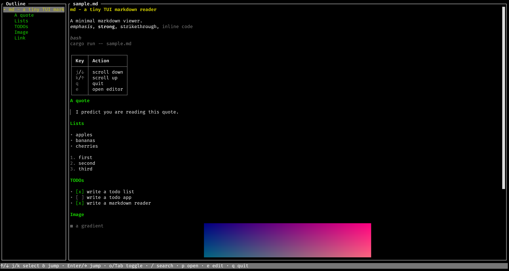
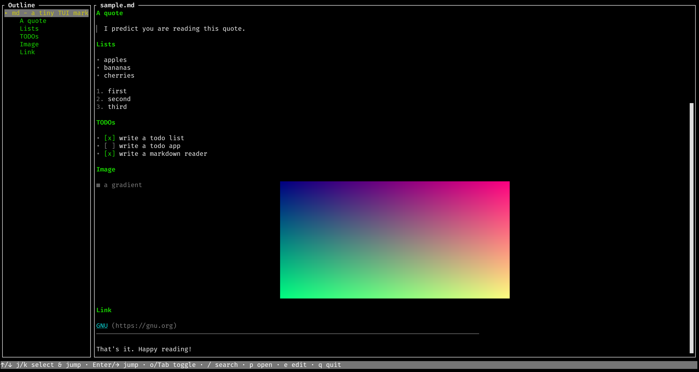

# md

A minimal markdown reader in your terminal, with inline image support, written in rust.

## Highlights

- **Full CommonMark, beautifully styled.** Headings with color-coded levels, *emphasis*, **strong**, ~~strikethrough~~, `inline code`, block quotes, horizontal rules.
- **Inline images.** PNGs and JPEGs are rendered directly into the buffer via the [Kitty graphics protocol](https://sw.kovidgoyal.net/kitty/graphics-protocol/).
- **Edit and re-read.** Press `e` to open the current file in `$EDITOR`, and the reader reloads with your changes the moment you save.
- **A built-in file picker.** Run `md` with no arguments and browse straight to a file.


## Screenshots



## Installation

### From source

```sh
cargo install --path .
```

Or just run it straight from the repo:

```sh
cargo run -- README.md
```

### Requirements

- A terminal that supports the [Kitty graphics protocol](https://sw.kovidgoyal.net/kitty/graphics-protocol/) for image rendering (Kitty, WezTerm, iTerm2, Ghostty, etc.). Text-only rendering works everywhere else.

## Usage

```sh
md [FILE]
```

With a file, `md` opens it directly. Without one, it starts in the file picker so you can navigate to whatever you want to read.

## Keybindings

### Reader

| Key            | Action                          |
|----------------|---------------------------------|
| `j` / `↓`      | scroll down (next heading)      |
| `k` / `↑`      | scroll up (previous heading)    |
| `PgDn` / `Space` | page down                     |
| `PgUp`         | page up                         |
| `g` / `G`      | top / bottom                    |
| `o` / `Tab`    | toggle outline                  |
| `/`            | search                          |
| `p`            | open file picker                |
| `e`            | edit in `$EDITOR` and reload    |
| `q` / `Esc`    | quit (Esc also closes outline)  |

### Search

| Key       | Action              |
|-----------|---------------------|
| `Enter`   | jump to first match |
| `Esc`     | cancel              |

### File picker

| Key       | Action                         |
|-----------|--------------------------------|
| `j` / `k` | navigate                       |
| `Enter`   | open file / enter directory    |
| `Backspace` | up a directory              |
| `h`       | toggle hidden files            |
| `g` / `G` | first / last entry             |
| `q` / `Esc` | quit (Esc returns to reader) |

